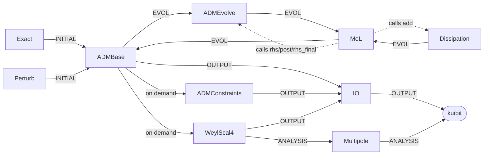

# pyNR

**Numerical relativity in Python, organised like the Einstein Toolkit.**

[](https://github.com/rahulkashyap-phy/pyNR/actions/workflows/tests.yml)
[](https://rahulkashyap-phy.github.io/pyNR)
[](https://codespaces.new/rahulkashyap-phy/pyNR)
[](https://mybinder.org/v2/gh/rahulkashyap-phy/pyNR/main?labpath=notebooks)
[](https://doi.org/10.5281/zenodo.23102127)

pyNR is a teaching and prototyping code for 3+1 numerical relativity.

**Author:** Rahul Kashyap, Indian Institute of Technology Bombay · <rahulkashyap@iitb.ac.in>

- **Same structure as the ET.** Thorns (`ADMBase`, `Exact`, `ADMEvolve`, `MoL`,
  `Dissipation`, `WeylScal4`, `Multipole`, `IOHDF5`, ...), schedule bins, and
  `.par` parameter files with the ET syntax. You can replace a component
  (initial data, formulation, integrator, kernel backend, output) without
  touching the rest.
- **Fast.** The grid loops are fused, multithreaded Numba kernels. A
  vectorised NumPy reference implementation checks them in the test suite.
- **Output kuibit can read.** Carpet-format HDF5 grid functions, scalar
  reductions and `mp_Psi4_l*_m*_r*.asc` multipoles, so every kuibit tool and
  plotting script works on a pyNR run.
- **Lecture notes in the code.** The docstrings carry the equations. The
  documentation site renders them next to the source, together with notes
  imported from TiddlyWiki.

## Quick start

```bash
python3 -m venv .venv && source .venv/bin/activate    # or a conda env, see docs/installation.md
pip install -e ".[viz]"
pynr run par/gauge_wave.par                  # AwA gauge wave, ~10 s -> simulations/gauge_wave/
pynr run par/schwarzschild_perturbed.par     # ring a black hole, extract Psi4
pytest                                       # convergence & compatibility tests
```

```python
from pynr import Simulation
from kuibit.simdir import SimDir

Simulation.from_parfile("par/gauge_wave.par").run()
sd = SimDir("simulations/gauge_wave")      # or pynr.paths.run_dir("gauge_wave")
sd.ts.maximum["alp"].y
```

Or open the repository in **GitHub Codespaces**. Verified students and
teachers get free hours through [GitHub Education](https://github.com/education).
Everything, including JupyterLab, is preinstalled.

## Building the documentation (HTML site + PDF lecture notes)

Run these commands **from the repository root**, the folder that contains `docs/`, `pynr/` and
`pyproject.toml`, with the virtual environment active. `make -C docs …` runs `make` inside `docs/`, so
`cd docs && make all` is equivalent.

```bash
cd pyNR                                   # repository root (your clone / worktree)
source .venv/bin/activate                 # the environment where pyNR is installed
pip install -e ".[docs]"                  # once: Sphinx, MyST, Graphviz bindings, matplotlib, PyYAML
pynr thorns --markdown > docs/reference/parameters.md   # parameter reference (generated)

make -C docs all        # PDF lecture notes (LaTeX) + HTML site that serves and links the PDF
make -C docs html       # HTML only
make -C docs latexpdf   # PDF only
make -C docs clean      # remove docs/_build and docs/_generated

open docs/_build/html/index.html                      # the site (macOS; `xdg-open` on Linux)
open docs/_build/latex/pyNR-lecture-notes.pdf         # the PDF
```

Requirements outside Python:
- **Graphviz** (`dot`) for the diagrams: `brew install graphviz` or `apt install graphviz`. Without it, the
  diagrams are replaced by a note.
- For the PDF, **TeX Live** with `lualatex` and `latexmk`: MacTeX, or
  `apt install latexmk texlive-luatex texlive-latex-extra texlive-fonts-recommended texlive-fonts-extra`.

The build draws the figures from `docs/data/`, the architecture diagrams from `arch/model.yaml`, and the problem
workflows from `par/*.par`. Everything it generates is git-ignored. See `docs/README.md` for details.

## What's in v0.1

| | |
|---|---|
| grid | uniform 3D Cartesian; static, radiative (Sommerfeld), flat and periodic boundaries |
| formulation | ADM (York), 4th-order finite differences, Kreiss-Oliger dissipation |
| time integration | method of lines: RK4, SSP-RK3, ICN, RK2 |
| gauge | lapse: static, harmonic, 1+log; shift: static (exact from the ID) |
| initial data | gauge wave, linear wave, Schwarzschild (isotropic), Kerr (Kerr-Schild, any spin) |
| perturbations | Gaussian $(\ell, m)$ shell on the metric |
| waves | $\Psi_4$ from $E_{ij}, B_{ij}$; spin-weighted multipoles on geodesic (icosahedral) spheres |
| diagnostics | Hamiltonian and momentum constraints |
| output | Carpet HDF5 (3D and 2D), CarpetIOScalar ASCII, Multipole ASCII |

Problems with equations and expected results are in
[the documentation](https://rahulkashyap-phy.github.io/pyNR/problems/). The
roadmap covers BSSN/Z4c, moving punctures, horizon
finding, elliptic initial data, mesh refinement and GPU/MPI.

## Architecture

<!-- arch:begin -->


*Thorns and the data flow between them, by schedule bin. Dotted arrows are callbacks. Generated from `arch/model.yaml`; the full interactive model is on the Architecture page of the docs.*
<!-- arch:end -->

## Layout

Every folder has its own README with commands to use that part on its own.

| folder | contents | README |
|---|---|---|
| `pynr/` | the package | [pynr/README.md](pynr/README.md) |
| `pynr/cactus/` | the "flesh": parfile, parameters, schedule, grid, main loop | [README](pynr/cactus/README.md) |
| `pynr/thorns/` | thorns (physics, analysis, I/O) | [README](pynr/thorns/README.md) |
| `pynr/kernels/` | Numba compute kernels (+ NumPy reference) | [README](pynr/kernels/README.md) |
| `pynr/utils/` | numerical methods: integrators, interpolation, geodesic spheres, SWSH | [README](pynr/utils/README.md) |
| `par/` | example parameter files (the problem set) | [README](par/README.md) |
| `notebooks/` | tutorials (Codespaces / Binder) | [README](notebooks/README.md) |
| `tests/` | test suite | [README](tests/README.md) |
| `docs/` | Sphinx + MyST site, including the [development log](docs/devlog/index.md) | [README](docs/README.md) |
| `scripts/` | benchmark, TiddlyWiki importer | [README](scripts/README.md) |

## License, attribution and citation

pyNR is licensed under the **Apache License 2.0** ([LICENSE](LICENSE)).
Copyright 2026 Rahul Kashyap, Indian Institute of Technology Bombay.

- **Attribution is required.** Any redistribution of pyNR, or of work derived
  from it, in source or binary form and for any purpose, academic or
  commercial, must include the [NOTICE](NOTICE) file, which names the author
  and affiliation (Apache-2.0 §4(d)). Each source file carries a copyright and
  SPDX header, which must be kept.
- **Please cite pyNR** in any publication, thesis, course material or product
  that uses it or builds on it. Use [CITATION.cff](CITATION.cff), or GitHub's
  "Cite this repository" button. The DOI [10.5281/zenodo.23102127](https://doi.org/10.5281/zenodo.23102127) (Zenodo) always
  resolves to the latest release; each release also has its own version DOI on Zenodo:

  > R. Kashyap, *pyNR: numerical relativity in Python, organised like the
  > Einstein Toolkit*, Indian Institute of Technology Bombay (2026),
  > https://doi.org/10.5281/zenodo.23102127

  ```bibtex
  @software{kashyap_pynr_2026,
    author      = {Kashyap, Rahul},
    title       = {{pyNR}: numerical relativity in Python, organised like the Einstein Toolkit},
    institution = {Indian Institute of Technology Bombay},
    year        = {2026},
    url         = {https://github.com/rahulkashyap-phy/pyNR},
    doi         = {10.5281/zenodo.23102127},
    publisher   = {Zenodo},
    license     = {Apache-2.0}
  }
  ```

Contact: Rahul Kashyap, <rahulkashyap@iitb.ac.in>.
